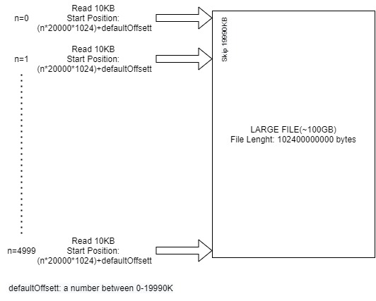

# storage-benchmark-csharp
 ## Why this benchmark?
 We need to test a specific read operation of large files from storage area networks. This benchmark tool measures the sequential and parallel read performance of large files in a particular way.
 
 ## Usage
    Usage:
      storage-benchmark-csharp[options]

    Options:
      --file-path<file-path> filePath
      --offset-option<offset-option> offsetOption[default: -1]
      --parallel-option parallelOption[default: False]
      -?, -h, --help Show help and usage information
      
 
 
 ## Example Read Scenario on a 100GB File 
 

 ## How to compile?
 1) Install Visual Studio(preferred) or VS Code
 2) Copy the clone link from Github and use clone repo option. [Visual Studio 2019]
 3) Build or run the solution
